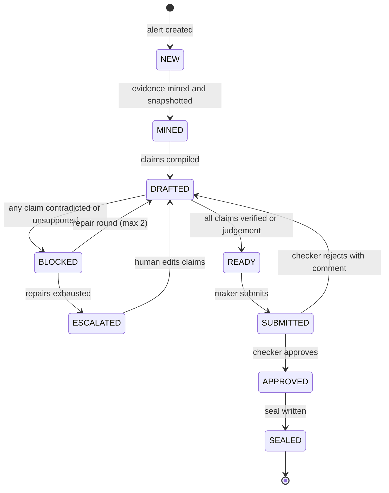

# Cairnquill: App Flow

Defines who does what, in which order, on which screen, and what the system does at each step. Use with `PRD.md`, `FRONTEND_GUIDELINES.md` and `BACKEND_SCHEMA.md`.

## 1. Roles

| Role | Can do | Cannot do |
|---|---|---|
| `investigator` (maker) | Open cases, mine evidence, draft, verify, repair, submit for approval | Approve own draft |
| `approver` (checker) | Review, approve or reject, trigger seal | Approve a draft they authored |
| `auditor` | Read filings, open evidence, replay, view scoreboard (KYC masked) | Edit anything |
| `dev` (demo mode only) | Inject errors, run planted-error suite | Not available outside demo mode |

A role switcher in the header sets the role for the demo. In a real deployment the role would come from Snowflake or the identity provider.

## 2. Navigation map

```
/queue ──► /case/:id ──► /case/:id/draft ──► /case/:id/review ──► /filings/:id
   │                                                                  │
   ├─ /filings  (history, search)  ◄──────────────────────────────────┘
   ├─ /eval     (scoreboard, planted-error runs)
   └─ /ask      (natural-language questions, regulatory search)
```

## 3. Case state machine



A case can never move to `SUBMITTED` while any claim is `CONTRADICTED` or `UNSUPPORTED`. This is enforced in the backend, not only in the UI.

## 4. Primary flow (happy path)

| # | Actor | Screen | Action | System response |
|---|---|---|---|---|
| 1 | Investigator | `/queue` | Opens the alert queue | Lists alerts by score and SLA due date; shows a countdown per case |
| 2 | Investigator | `/queue` | Selects an alert | Creates or opens a case; routes to `/case/:id` |
| 3 | Investigator | `/case/:id` | Presses **Mine evidence** | Runs pattern SQL, writes `EVIDENCE.CAIRNS`, copies rows to `EVIDENCE.CASE_ROWS`; shows the subgraph and KYC panel |
| 4 | Investigator | `/case/:id` | Reviews pattern, amounts, timing | Highlights detected typology and the regulatory limb it maps to |
| 5 | Investigator | `/case/:id/draft` | Presses **Draft report** | Backend calls Snowflake Cortex with evidence facts; stores `CASES.DRAFTS` with claims JSON |
| 6 | System | `/case/:id/draft` | Auto-verifies | Surveyor runs SQL per claim; writes `CASES.VERDICTS`; the cairn stack fills as claims verify |
| 7a | System | `/case/:id/draft` | If any claim fails | Draft is blocked; failed claims show expected vs actual; **Repair** button appears |
| 7b | Investigator | `/case/:id/draft` | Presses **Repair** | Failed claims regenerated with actual values; re-verify; up to 2 rounds |
| 8 | Investigator | `/case/:id/draft` | Edits text, adds judgement notes | Judgement claims are labelled and never counted as verified |
| 9 | Investigator | `/case/:id/draft` | Presses **Submit for approval** | Status `SUBMITTED`; event logged |
| 10 | Approver | `/case/:id/review` | Opens review | Sees draft, per-claim evidence, recall check, verdicts |
| 11 | Approver | `/case/:id/review` | Presses **Approve** | Backend checks approver differs from author; status `APPROVED` |
| 12 | System | `/case/:id/review` | Seals | Writes `AUDIT.FILINGS` with `seal_sha` chained to the previous seal; status `SEALED` |
| 13 | Auditor | `/filings/:id` | Opens a filing | Sees the report with each sentence linked to evidence |
| 14 | Auditor | `/filings/:id` | Presses **Replay** | Reloads stored claims and snapshot, re-verifies, recomputes hash; shows match or tamper warning |

## 5. Alternate and failure flows

| Situation | Behaviour |
|---|---|
| LLM returns invalid JSON | Validate against schema, retry once, then show "Draft couldn't be generated. Try again or write claims manually." |
| Claim cites a non-existent evidence ID | Verdict `UNSUPPORTED`; draft blocked |
| Numeric mismatch | Verdict `CONTRADICTED`; show asserted vs actual; draft blocked |
| Repairs exhausted | Status `ESCALATED`; investigator edits claims by hand; re-verify |
| Approver rejects | Comment required; case returns to `DRAFTED` |
| Same user tries to approve own draft | 403 with message "A different person must approve this draft." |
| Replay hash mismatch | Red banner "This filing no longer matches its seal"; event logged; do not allow edits |
| SLA due within 24 hours | Case row turns warning state; badge in header |
| SLA breached | Case flagged overdue; stays workable |
| Snowflake unavailable | Banner with retry; no partial writes are shown as success |
| No evidence found | Empty state: "No matching pattern in this window. Widen the window or check another account." |

## 6. Demo-mode flow (inject error)

1. Auditor or dev opens a verified draft.
2. Presses **Inject error** (demo mode only). The backend mutates one claim copy (for example, amount ×1.1).
3. Surveyor re-runs. The mutated claim returns `CONTRADICTED`; the cairn stack wobbles; the draft shows "Blocked".
4. Presses **Restore** to undo. The mutation is never persisted to a filing.

This is the live moment of the demo. Keep it under 20 seconds.

## 7. Screen inventory

| Screen | Purpose | Primary actions | Key states |
|---|---|---|---|
| Queue | Triage alerts | Open case, filter by typology and SLA | Empty, loading, overdue, error |
| Case | Understand the case | Mine evidence, open drafting | Not mined, mining, mined, no evidence |
| Draft | Write and verify | Draft, repair, edit, submit | Drafting, verifying, blocked, ready |
| Review | Approve or reject | Approve, reject with comment | Awaiting, self-approval blocked |
| Filing | Read-only proof | Replay, open evidence | Sealed, replaying, match, mismatch |
| Filings | History | Search, open | Empty, results |
| Eval | Scoreboard | Run planted-error suite | Not run, running, results |
| Ask | Natural-language helper | Ask question, view sources | Answer with sources, abstained |

## 8. Ask flow (Cortex Agent)

1. User asks a question such as "How many open alerts are due this week?" or "What does the PMLA definition say about unusual complexity?"
2. Backend sends the question to the Cortex Agent.
3. Agent routes to Cortex Analyst (Semantic View) for metrics or Cortex Search for regulatory text.
4. UI shows the answer with the SQL or the cited source passage.
5. If no source supports an answer, the agent abstains and the UI says what it could not find.

The Ask flow is a helper. It is never in the filing path, so filings stay deterministic.

## 9. Developer flow (CLI)

```
cairnquill init                  # write cairnquill.yml, check Snowflake connection
cairnquill compile case_0142     # Quill: claims from evidence
cairnquill verify  case_0142     # Surveyor: verdicts
cairnquill seal    case_0142    # Waymark: seal (requires approval token in demo)
cairnquill replay  case_0142     # recompute and compare
cairnquill eval --plant-errors   # planted-error suite
```

Status: planned interface for T3. The CLI calls the same core library as the API.
